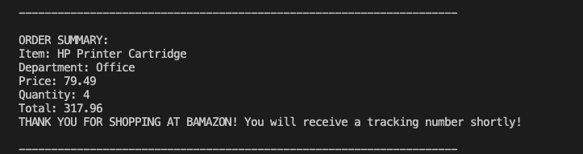
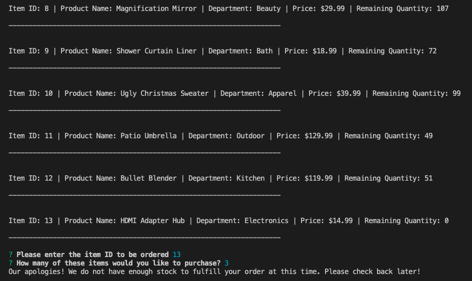
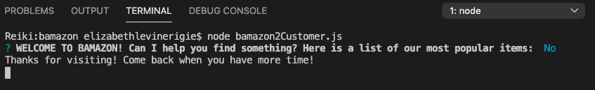

# Bamazon: the ultimate shopping experience!  :shopping:

The BAMAZON experience begins with an initial greeting welcoming the customer and prompting them to answer Y/N if they would like to continue shopping. If yes, the user is presented with a list of the most popular items in stock. Each line-item in the table contains an id number as well as the corresponding department, price, and remaining stock quantity.

If the customer would like to place an order, they are prompted (via Inquirer Node Package) to enter the item Id, followed by a separate prompt asking how many they would like to order.

If there is adequate stock to fulfill a request, the order is processed and a confirmation message is displayed. The program will update the database and stock levels will be adjusted. If their order exceeds the number of items in stock, a message indicating such will be returned to the customer.

When an order is completed, a summary confirmation will be returned to the customer as an object:

## Building Bamazon: Required tools & tech  :hammer_and_wrench:

To build this NODE.js command line application, NPM is initialized and Inquirer and mysql NPM packages are installed in the root directory. The Inquirer module is required in order to prompt the customer.

The inventory feauture is built using MySQL database with a products table containing each item, their correpsonding id, department, price and stock level.

- Inquirer: (https://www.npmjs.com/package/inquirer)
- MySQL: (https://www.npmjs.com/package/mysql)

## Functionality for the Bamazon customer experience 

### Example of prompt with customer input; :shopping_cart:

### When the order exceeds stock levels; :x:

### When the customer decides not to stay;

